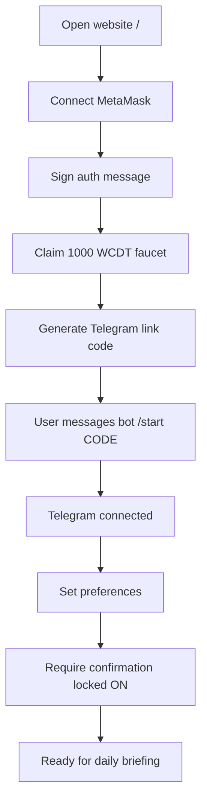
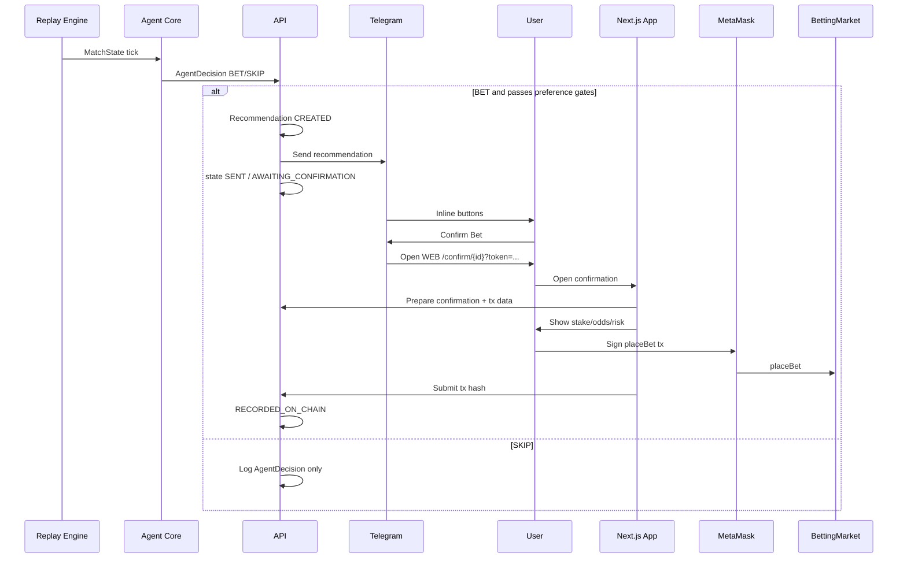
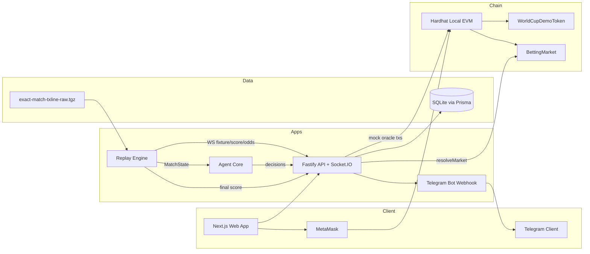
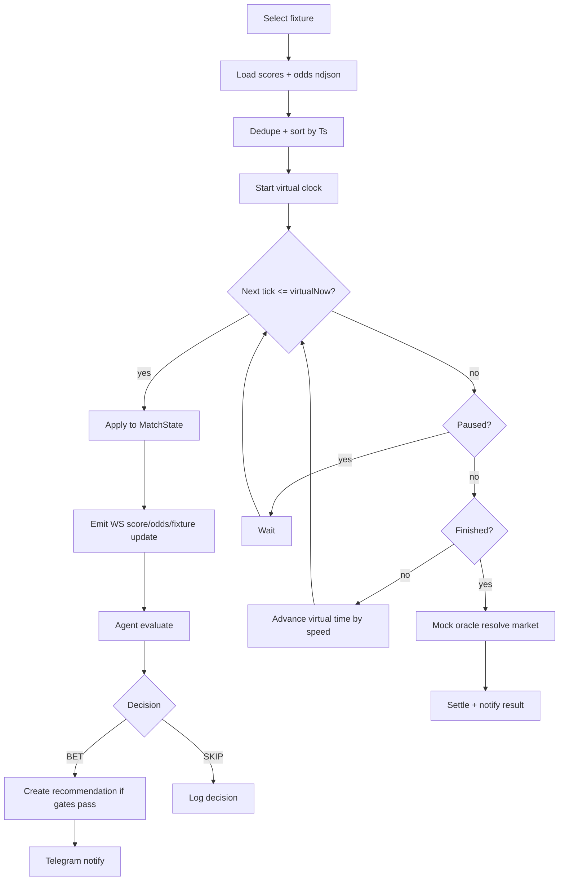
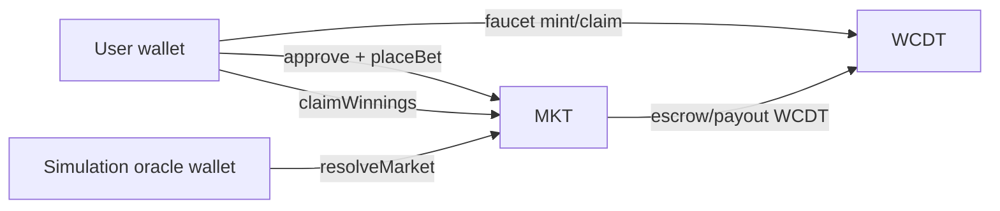
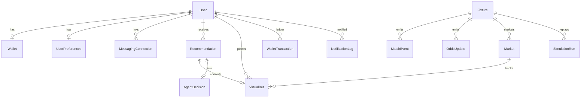
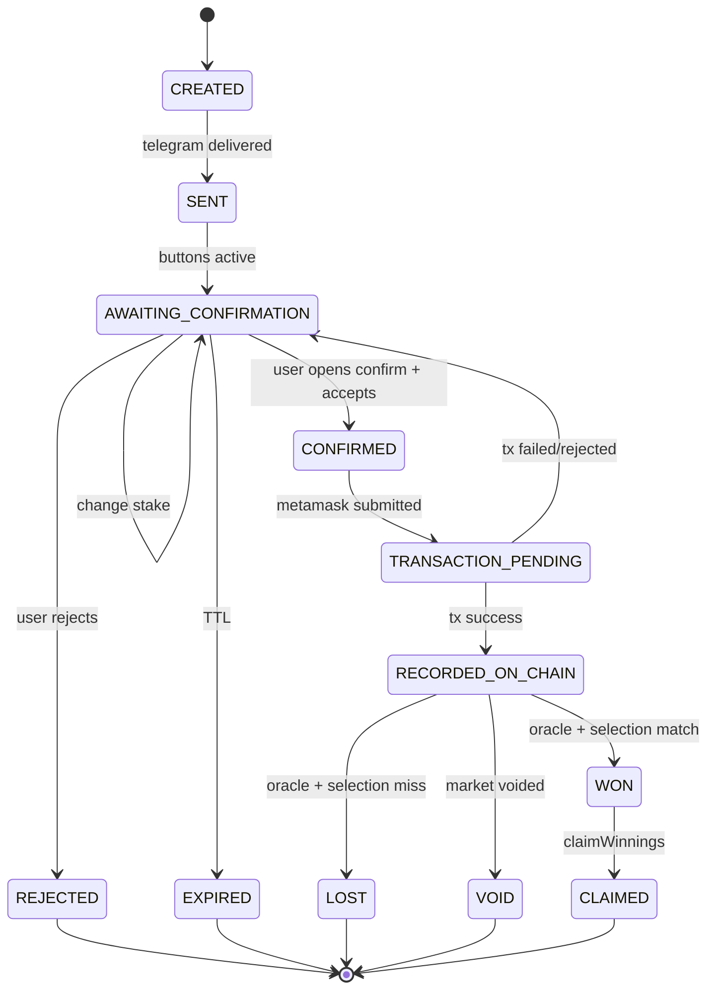
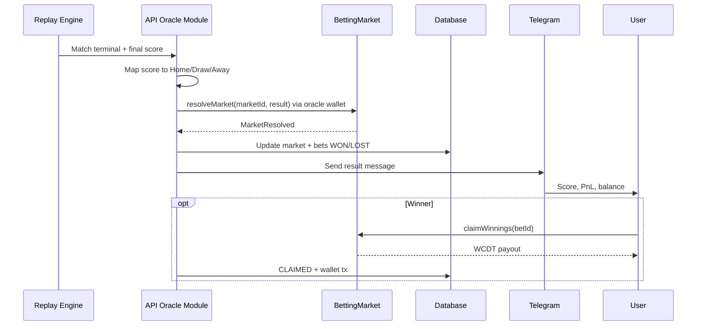

# World Cup Betting Agent — Project Specification

**Document status:** Implementation-ready MVP specification  
**Prototype name:** World Cup Betting Agent  
**Audience:** Hackathon engineering team  
**Last updated:** 2026-07-17  

> **Simulation disclaimer (read first):** This product is a **simulation-only** Web3 sports-betting agent. All tokens, odds, stakes, payouts, and settlements are virtual. There is **no real money**, **no real bookmaker**, and **no mainnet deployment** in the MVP. The agent does **not** guarantee profit.

> **⛓ Chain: Solana (authoritative — see [`docs/SOLANA.md`](docs/SOLANA.md)).** This build runs on
> **Solana** via an **Anchor program** + **SPL token**, not the EVM/Hardhat/MetaMask stack described
> in §8 (Chain), §12, §13, §14, and Appendix B — those sections are **superseded by `docs/SOLANA.md`**.
> All chain-agnostic sections (TxLINE replay §9–§10, agent §11, Telegram §15, database §17) remain valid.

---

## Table of contents

1. [Executive summary](#1-executive-summary)
2. [Problem statement](#2-problem-statement)
3. [Proposed solution](#3-proposed-solution)
4. [Simulation disclaimer](#4-simulation-disclaimer)
5. [Target users](#5-target-users)
6. [Main features](#6-main-features)
7. [User flow](#7-user-flow)
8. [System architecture](#8-system-architecture)
9. [Dataset analysis](#9-dataset-analysis)
10. [Replay-engine design](#10-replay-engine-design)
11. [Betting-agent design](#11-betting-agent-design)
12. [Web3 architecture](#12-web3-architecture)
13. [Smart-contract design](#13-smart-contract-design)
14. [Mock-oracle design](#14-mock-oracle-design)
15. [Telegram integration](#15-telegram-integration)
16. [WhatsApp future integration](#16-whatsapp-future-integration)
17. [Database design](#17-database-design)
18. [API design](#18-api-design)
19. [Frontend pages](#19-frontend-pages)
20. [Security considerations](#20-security-considerations)
21. [Edge cases](#21-edge-cases)
22. [Testing strategy](#22-testing-strategy)
23. [Project folder structure](#23-project-folder-structure)
24. [Development roadmap](#24-development-roadmap)
25. [Team allocation](#25-team-allocation)
26. [MVP acceptance criteria](#26-mvp-acceptance-criteria)
27. [Future improvements](#27-future-improvements)
28. [Demo script](#28-demo-script)

---

## 1. Executive summary

**World Cup Betting Agent** is a hackathon prototype that combines:

- a **match replay engine** driven by real TxLINE World Cup capture data;
- a **rule-based betting agent** that produces Home / Draw / Away recommendations;
- **Telegram** delivery of daily briefings, recommendations, and settlement results;
- a **Next.js + Solana wallet-adapter (Phantom)** confirmation flow;
- an **Anchor program on Solana** that records simulated bets using an SPL demo token (**WCDT**).

Users never place a bet without explicit confirmation. Confirmed bets are signed with the user's Solana wallet and stored on a local validator (or devnet). After replay finishes, a **mock oracle** (the backend oracle keypair) resolves the market and Telegram notifies the user of win/loss and updated virtual balance.

---

## 2. Problem statement

World Cup fans want timely betting ideas, but real-money automation is legally and ethically risky. Hackathon demos also need a credible “live match → agent → wallet → settlement” loop without depending on live bookmaker APIs or mainnet funds.

Existing gaps this prototype addresses:

| Gap | Why it matters |
| --- | --- |
| No safe end-to-end betting agent demo | Teams cannot show Web3 + messaging + sports data together without real money |
| Live feeds are hard to demo | Matches must be reproducible on stage |
| Agent trust | Users need confirmation, explanation, and risk limits |
| Settlement story | On-chain bet records need a clear oracle path |

---

## 3. Proposed solution

Build a **simulation stack** that:

1. Replays TxLINE `scores.ndjson` + `odds.ndjson` for selected World Cup fixtures.
2. Maintains a synchronised `MatchState` (score, clock, events, 1X2 odds).
3. Runs a rule-based `BettingStrategy` that may emit `BET` or `SKIP`.
4. Sends recommendations to Telegram with Confirm / Reject / More Analysis / Change Stake.
5. Opens a secure web confirmation page for MetaMask signing.
6. Records bets in `BettingMarket` + `WorldCupDemoToken` contracts.
7. Resolves markets from the final replayed score via an authorised mock-oracle wallet.
8. Shows portfolio, P/L, and history in the web app.

### Explicit assumptions

| Assumption | Rationale |
| --- | --- |
| One MetaMask wallet per user in MVP | Simplifies auth and portfolio |
| Telegram first; WhatsApp later | Faster messaging MVP |
| Markets = match-result 1X2 only | Aligns with `Outcome {Home,Draw,Away}` |
| Odds prices are decimal odds × 1000 | Empirically validated against `Pct` fields |
| Team display names are mapped from a local fixture catalogue | Raw feed uses numeric `Participant*Id` |
| Local Hardhat is the primary chain | No mainnet; optional testnet after local works |
| Confirmation is always required | Product + security requirement for MVP |
| Agent is rule-based, not ML | Predictable demo behaviour |

---

## 4. Simulation disclaimer

The product UI, Telegram copy, contracts, and README **must** state:

- WCDT has **no monetary value**.
- Odds are **simulated** from historical/captured feed data.
- Bets are **virtual** and for demonstration only.
- The agent can be wrong; it does **not** guarantee profit.
- This is **not** a licensed gambling product.

Recommended persistent UI chrome:

- Top-bar badge: `SIMULATION ONLY — NO REAL MONEY`
- Confirm page risk warning before MetaMask signature
- Telegram footer on every betting-related message

---

## 5. Target users

| Persona | Goal | MVP value |
| --- | --- | --- |
| Hackathon judges / demo audience | See a complete story in ~5 minutes | Scripted replay + Telegram + MetaMask |
| Football fans exploring “agent betting” | Receive explained recommendations | Messaging + confidence + reasoning |
| Web3 builders | Inspect on-chain bet lifecycle | Local contracts + portfolio |

Out of scope for MVP: professional tipsters, real bankroll management, multi-wallet power users.

---

## 6. Main features

### 6.1 MVP features

| Area | Feature |
| --- | --- |
| Wallet | Connect MetaMask, SIWE-style signature auth |
| Token | WCDT faucet (1,000 WCDT) |
| Messaging | Telegram link + daily briefing + recommendation + result |
| Preferences | Confidence, stake, daily loss, mode, favourite teams, markets |
| Data | Replay 6 TxLINE World Cup fixtures |
| Agent | Rule-based Home/Draw/Away or SKIP |
| Confirmation | Always required; Confirm opens web app |
| Chain | Create/close/place/resolve/claim on local Hardhat |
| Oracle | Backend simulation wallet resolves from final score |
| Portfolio | Balance, staked, returned, P/L, win rate, history |
| Dashboard | Live score, timeline, odds, agent confidence, replay controls |

### 6.2 Explicitly out of MVP

- Real-money betting
- Mainnet deployment
- Real bookmaker integration
- WhatsApp sending (document only)
- ML / LLM betting models as primary strategy
- Multi-wallet accounts
- Cash-out / partial settle
- Asian handicap / over-under betting markets (odds may be ingested for signals, but bettable market is 1X2)

### 6.3 Future features

See [§27](#27-future-improvements).

---

## 7. User flow

### 7.1 Primary journey

1. User opens the website (`/`).
2. User connects MetaMask.
3. User receives **1,000 WCDT** from the faucet.
4. User connects Telegram (linking code).
5. User selects notification and betting preferences (`/settings` or onboarding).
6. Agent sends the list of World Cup matches for the day (Telegram daily briefing).
7. Agent analyses each match during replay.
8. Agent sends a recommendation **before / during** a selected match window.
9. Message includes: match, market, selection, simulated odds, confidence, suggested stake, potential payout, explanation.
10. User chooses: **Confirm Bet** / **Reject** / **More Analysis** / **Change Stake**.
11. Confirm Bet opens the web application with a secure recommendation ID.
12. Application shows final confirmation screen (`/confirm/[id]`).
13. User signs the simulated bet with MetaMask.
14. Smart contract records the bet.
15. Replay engine continues the match.
16. Mock oracle submits the final result.
17. Smart contract settles / marks market resolved (claim flow for winnings).
18. Telegram / (future WhatsApp) sends the result.
19. User views wallet balance, profit/loss, and betting history.

### 7.2 Onboarding flow (Mermaid)



### 7.3 Recommendation and confirmation flow (Mermaid)



---

## 8. System architecture

### 8.1 Overall architecture (Mermaid)



### 8.2 Runtime responsibilities

| Component | Responsibility |
| --- | --- |
| `apps/web` | Wallet UX, confirmation, portfolio, replay dashboard |
| `apps/api` | Auth, preferences, recommendations, Telegram webhook, oracle triggers |
| `apps/replay-engine` | Parse TGZ data, clocked replay, pause/resume/speed |
| `packages/agent-core` | Rule strategies, SKIP gates, explanations |
| `packages/contracts` | WCDT + BettingMarket + Hardhat deploy/tests |
| `packages/database` | Prisma schema + migrations |
| `packages/shared-types` | Zod/TS types shared across apps |
| `packages/config` | Env schema, chain IDs, constants |

---

## 9. Dataset analysis

Source archive: `exact-match-txline-raw.tgz` (also referenced as project data root).

Archive README title: **World Cup match data — raw TxLINE only**.

### 9.1 Folder and file structure

```text
exact-match-txline-raw.tgz
└── txline-raw/
    ├── README.md
    ├── 18209181/
    │   ├── scores.ndjson
    │   ├── odds.ndjson
    │   └── historical.raw.json
    ├── 18213979/
    │   ├── scores.ndjson
    │   ├── odds.ndjson
    │   └── historical.raw.json
    ├── 18218149/
    │   ├── scores.ndjson
    │   ├── odds.ndjson
    │   └── historical.raw.json
    ├── 18222446/
    │   ├── scores.ndjson
    │   ├── odds.ndjson
    │   └── historical.raw.json
    ├── 18237038/
    │   ├── scores.ndjson
    │   └── odds.ndjson          # no historical.raw.json
    └── 18241006/
        ├── scores.ndjson
        └── odds.ndjson          # no historical.raw.json
```

Notes:

- Folder name = TxLINE `fixtureId`.
- macOS AppleDouble files (`._*`) exist in the archive and **must be ignored** by parsers.
- Bundle contains **only data TxLINE sent** (no pre-materialised timelines).

### 9.2 Fixtures catalogue

| FixtureId | README label / result | Scores lines | Odds lines | historical.raw.json | Notes |
| --- | ---: | ---: | ---: | --- | --- |
| 18209181 | FRA-MAR **2-0** | 1,286 | 35,838 | Yes | Duplicate score envelope IDs observed |
| 18213979 | **1-2** (extra time) | 1,179 | 44,410 | Yes | Longer wall-clock span |
| 18218149 | **2-1** | 528 | 14,505 | Yes | Ends with `disconnected` |
| 18222446 | **3-1** (ET; only red card) | 1,294 | 43,011 | Yes | Use for red-card agent rules |
| 18237038 | **0-2** | 1,013 | 37,040 | **No** | Replay from ndjson only |
| 18241006 | **1-2** | 954 | 33,700 | **No** | Ends with `disconnected` |

**Important:** Repeated odds updates are **not** separate football matches. One folder = one fixture.

### 9.3 Score / match-event data (`scores.ndjson`)

Each line is:

```json
{ "id": "<TxLINE SSE event id>", "data": { /* TxLINE score frame */ } }
```

Important `data` fields:

| Field | Meaning |
| --- | --- |
| `FixtureId` | Fixture identifier |
| `Action` | Event type (`goal`, `shot`, `corner`, `var`, …) |
| `Seq` | Monotonic-ish sequence within connection |
| `Ts` | Event timestamp (epoch **milliseconds**) |
| `StatusId` | Match phase |
| `Clock.Seconds` | Match clock seconds |
| `Clock.Running` | Whether clock is running |
| `Stats` | Cumulative stat map by stat code |
| `Confirmed` | Boolean; critical for goals/VAR |
| `Participant` / `Participant1Id` / `Participant2Id` | Side / team ids |
| `Possession` / `PossessionType` | Possession context |
| `GameState` | Present but often still `"scheduled"` during live — **do not trust alone** |
| `StartTime` | Fixture start (epoch ms) |

#### Stat codes (from archive README)

| Base code | Meaning |
| ---: | --- |
| 1 / 2 | Team1 / Team2 goals |
| 3 / 4 | Yellow cards |
| 5 / 6 | Red cards |
| 7 / 8 | Corners |

Period-prefixed: `code = period * 1000 + base`  
Examples: `1001` = 1st-half team1 goals, `2007` = 2nd-half team1 corners.

#### StatusId (phase)

Documented in archive README:

| StatusId | Phase |
| ---: | --- |
| 2 | 1st half |
| 3 | Halftime |
| 4 | 2nd half |
| 5 | Full time |

Observed in this dataset beyond README (implementers should handle):

| StatusId | Observed interpretation |
| ---: | --- |
| 1 | Pre-match / warm-up |
| 6–10 | Extra-time / later phases (ET fixtures) |
| 100 | Terminal finalised marker (`game_finalised`) |
| `null` | Sparse frames without phase |

#### High-value `Action` values for the agent

| Action | Use |
| --- | --- |
| `shot` | Pressure signal |
| `corner` | Set-piece pressure |
| `danger_possession` | Dangerous attack |
| `high_danger_possession` | High-danger attack |
| `yellow_card` / `red_card` | Discipline / strength |
| `goal` | Score change candidate |
| `var` / `var_end` | Freeze recommendations |
| `possible` | Unconfirmed speculative event — treat cautiously |
| `action_discarded` / `action_amend` / `score_adjustment` | Correct prior state |
| `game_finalised` / `halftime_finalised` | Phase boundaries |
| `disconnected` | Feed ended uncleanly |

### 9.4 Odds update data (`odds.ndjson`)

Same envelope: `{ "id", "data" }`.

Important `data` fields:

| Field | Meaning |
| --- | --- |
| `FixtureId` | Fixture id |
| `Ts` | Epoch ms |
| `Bookmaker` / `BookmakerId` | Source book (demo uses TxLINE stable price) |
| `SuperOddsType` | Market family |
| `MarketParameters` | e.g. `line=2.25` |
| `MarketPeriod` | e.g. `half=1` or `null` for match |
| `PriceNames` | Outcome labels |
| `Prices` | Integer prices |
| `Pct` | Implied probability strings or `"NA"` |
| `InRunning` | Pre-match vs in-play |

#### Market types present in the bundle

| SuperOddsType | PriceNames | MVP betting? |
| --- | --- | --- |
| `1X2_PARTICIPANT_RESULT` | `part1`, `draw`, `part2` | **Yes — primary** |
| `OVERUNDER_PARTICIPANT_GOALS` | `over`, `under` | Signal only in MVP |
| `ASIANHANDICAP_PARTICIPANT_GOALS` | `part1`, `part2` | Signal only in MVP |

#### Price format

Empirical mapping validated against `Pct`:

```text
decimalOdds = Prices[i] / 1000
```

Example:

```json
"PriceNames": ["part1", "draw", "part2"],
"Prices": [1595, 4058, 7887],
"Pct": ["62.696", "24.643", "12.679"]
```

→ decimal odds ≈ `1.595`, `4.058`, `7.887`.

MVP should prefer **match-level** 1X2 rows where `MarketPeriod == null` (or empty). Half-time 1X2 rows (`half=1`) may be stored for analytics but not used as the bettable market unless explicitly selected later.

### 9.5 `historical.raw.json`

- Present for **4 of 6** fixtures.
- Despite `.json` extension, format is **SSE-style lines**: `data: {...}`.
- Useful as optional backfill / validation, **not required** for replay (ndjson is enough).
- Parser must strip `data:` prefix per line.

### 9.6 Timestamp format

| Field | Format |
| --- | --- |
| Envelope `id` | Often `{epochMs}:{counter}` string |
| `data.Ts` | Epoch **milliseconds** (number) |
| `StartTime` | Epoch milliseconds |

Replay clock should key off `data.Ts`.

### 9.7 Duplicate event handling

Rules for the ingestion/replay layer:

1. **Do not treat odds ticks as new matches.** Partition always by `FixtureId` / folder.
2. Deduplicate score frames by envelope `id` when replaying (fixture `18209181` contains **413** duplicate score envelope IDs). Keep first, or keep highest `Seq` / latest content hash — pick one strategy and apply consistently. Recommended: **first-seen wins** for identical `id`, but still apply later frames with new `id` that amend state (`action_amend`, confirmed goals).
3. Odds updates are intentionally frequent; store as time series, keyed by `(FixtureId, Ts, SuperOddsType, MarketParameters, MarketPeriod, MessageId?)`.
4. Goal lifecycle example from FRA-MAR:
   - Unconfirmed `goal` may arrive with **old Stats** and `Confirmed: false`.
   - Later `Confirmed: true` updates Stats to the new score.
   - Agent **must SKIP** while a goal is unconfirmed or VAR is active.
5. `action_discarded` / `score_adjustment` must rewrite materialised match state, not append blind counters.

### 9.8 Synchronising match events and odds

Recommended materialised stream:

```text
MergedTick {
  fixtureId,
  ts,
  kind: "score" | "odds",
  payload
}
```

Algorithm:

1. Load both ndjson files for a fixture.
2. Parse + dedupe.
3. Sort by `Ts` ascending; stable-sort ties as `score` before `odds` (or by `Seq` within scores).
4. Maintain `MatchState`:
   - from scores: clock, status, stats, recent event window;
   - from odds: latest 1X2 decimals + probabilities.
5. Emit ticks to Socket.IO and agent on each applied frame (subject to replay speed).

Staleness rule (MVP default):

- If no score tick for > 120s of **replay timeline time** during an in-play phase, mark `dataStale=true` and force agent `SKIP`.

### 9.9 Live-style replay

Treat the first tick’s `Ts` as `t0`. Virtual time:

```text
virtualNow = t0 + (wallElapsed * speedMultiplier) + pauseOffset
```

Emit all events with `event.Ts <= virtualNow`.

Controls:

| Control | Behaviour |
| --- | --- |
| Start | Begin from kickoff window or first tick |
| Pause | Freeze virtual clock |
| Resume | Continue from paused virtual time |
| Restart | Reset state + virtual clock to beginning |
| Match selection | Switch fixture; stop previous run |
| Speed | `1x`, `10x`, `30x`, `60x` |

### 9.10 Dataset problems discovered

| Issue | Impact | Mitigation |
| --- | --- | --- |
| Odds volume ≫ score volume | Easy to mis-model as many matches | Fixture-scoped replay only |
| Duplicate score envelope IDs | Inflated event counts / double signals | Dedupe by `id` |
| Unconfirmed goals before Stats update | False score reads | Require `Confirmed===true` for score-affecting actions |
| VAR / `possible` actions | Premature recommendations | SKIP gates |
| `GameState` stuck on `scheduled` | Bad status if trusted | Prefer `StatusId` + Actions |
| Missing `historical.raw.json` for 2 fixtures | Incomplete backfill | Use ndjson as source of truth |
| `historical.raw.json` is SSE, not JSON | Naive `JSON.parse` fails | Line parser with `data:` strip |
| Some feeds end with `disconnected` | No clean FT frame | Resolve from last confirmed Stats + README final score fallback |
| StatusId values beyond README (`1,6–10,100,null`) | Phase mapping incomplete | Extend enum; treat unknown as non-betting unless FT/finalised |
| No human team names in frames | UI needs labels | Static fixture map (FRA-MAR etc.) |
| AppleDouble `._*` files | Parser noise | Ignore |
| Archive currently at repo root | Structure mismatch vs proposed monorepo | Move/copy to `data/` during Phase 1 |

---

## 10. Replay-engine design

### 10.1 Responsibilities

- Unpack / read fixture files from `data/exact-match-txline-raw.tgz` or extracted folder.
- Build deterministic merged timeline per fixture.
- Expose control API: start/pause/resume/restart/speed/select.
- Publish realtime updates over Socket.IO (via API).
- Notify API when match reaches resolvable terminal state.
- Act as timing source for mock-oracle settlement.

### 10.2 Core types

```typescript
type ReplaySpeed = 1 | 10 | 30 | 60;

interface ClockState {
  seconds: number;
  running: boolean;
}

interface MatchState {
  fixtureId: string;
  statusId: number | null;
  clock: ClockState;
  score: { home: number; away: number };
  stats: Record<string, number>;
  recentEvents: MatchEvent[];
  odds1x2?: {
    home: number; // decimal
    draw: number;
    away: number;
    homePct?: number;
    drawPct?: number;
    awayPct?: number;
    ts: number;
  };
  flags: {
    varActive: boolean;
    unconfirmedGoal: boolean;
    dataStale: boolean;
    marketClosed: boolean;
  };
  updatedAt: number; // virtual ts
}

interface ReplayControls {
  start(fixtureId: string): void;
  pause(): void;
  resume(): void;
  restart(): void;
  setSpeed(speed: ReplaySpeed): void;
  selectMatch(fixtureId: string): void;
}
```

### 10.3 Match replay + agent-decision flow (Mermaid)



### 10.4 Simulation run model

Each operator-triggered replay creates a `SimulationRun`:

- `fixtureId`
- `speed`
- `startedAt` / `pausedAt`
- `status: IDLE | RUNNING | PAUSED | COMPLETED | FAILED`
- pointer to last applied tick index

Only one active run per demo environment is required for MVP (can be global singleton). Multi-tenant concurrent replays are future work.

---

## 11. Betting-agent design

### 11.1 Principles

- Rule-based, deterministic, explainable.
- Every BET includes confidence, stake suggestion, odds, payout, reason.
- Prefer `SKIP` when uncertain — quieter is safer for a simulation demo.
- Never claim guaranteed profit.

### 11.2 Strategy interface

```typescript
interface UserPreferences {
  favouriteTeams: string[];
  matchScope: "all" | "selected";
  selectedFixtureIds: string[];
  minConfidence: number; // 0-100
  maxStakePerBet: number; // WCDT
  maxDailyVirtualLoss: number; // WCDT
  mode: "conservative" | "balanced" | "aggressive";
  notificationTimeLocal?: string;
  telegramEnabled: boolean;
  whatsappEnabled: boolean; // stored, unused in MVP send path
  requireConfirmation: true; // locked true in MVP
  preferredMarkets: Array<"1X2">;
}

type AgentDecisionType = "BET" | "SKIP";

interface AgentDecision {
  type: AgentDecisionType;
  strategyName: string;
  market: "1X2";
  selection?: "Home" | "Draw" | "Away";
  confidence: number; // 0-100
  suggestedStake: number;
  simulatedOdds?: number;
  potentialPayout?: number;
  reason: string;
  skipReason?: string;
  features: Record<string, number | string | boolean>;
}

interface BettingStrategy {
  name: string;
  evaluate(state: MatchState, preferences: UserPreferences): AgentDecision;
}
```

### 11.3 Signals analysed

| Signal | Source |
| --- | --- |
| Current score | `Stats[1]`, `Stats[2]` when confirmed |
| Match minute | `Clock.Seconds / 60` |
| Recent shots | rolling window of `Action=shot` |
| Recent corners | `Action=corner` + stat deltas |
| Dangerous possessions | `danger_possession` |
| High-danger possessions | `high_danger_possession` |
| Yellow / red cards | actions + stats 3–6 |
| Odds movement | delta of 1X2 decimals / pct |
| Market probability | `Pct` or `1/odds` normalised |
| Match status | `StatusId` |
| VAR / unconfirmed | `var`, `Confirmed===false` goals |

### 11.4 Example decision

```text
Recommendation: Home Win
Confidence: 78%
Suggested stake: 20 WCDT
Simulated odds: 1.75
Potential payout: 35 WCDT
Reason: The home team has stronger recent pressure and its estimated probability is higher than the simulated market probability.
```

### 11.5 SKIP conditions (mandatory)

Skip when any is true:

| Condition | Reason code |
| --- | --- |
| Confidence < user minimum | `LOW_CONFIDENCE` |
| Unconfirmed goal outstanding | `UNCONFIRMED_GOAL` |
| VAR active (`var` without `var_end`) | `VAR_ACTIVE` |
| 1X2 odds unavailable / stale | `ODDS_UNAVAILABLE` |
| Market closed on-chain or locally | `MARKET_CLOSED` |
| Data stale | `DATA_STALE` |
| Daily virtual loss limit reached | `DAILY_LOSS_LIMIT` |
| User already bet same market/fixture | `ALREADY_BET` |
| Fixture not in user selection scope | `OUT_OF_SCOPE` |
| Pre-match / unknown phase if strategy requires live | `INVALID_PHASE` |

### 11.6 Mode modifiers

| Mode | Effect |
| --- | --- |
| Conservative | Higher confidence floor (+10), smaller stake factor (0.5×) |
| Balanced | Defaults |
| Aggressive | Lower effective floor (-5), stake factor (1.25×) capped by max stake |

Suggested stake formula (MVP):

```text
rawStake = maxStakePerBet * (confidence/100) * modeFactor
suggestedStake = roundTo1(min(rawStake, maxStakePerBet, availableBalance * 0.1))
```

### 11.7 Initial strategy: `PressureEdgeV1`

High-level rules:

1. Build model probability from recent pressure features + score state.
2. Compare to market implied probability for Home/Draw/Away.
3. Select outcome with highest positive edge if edge ≥ threshold.
4. Else SKIP.

Edge threshold defaults: Conservative 8%, Balanced 5%, Aggressive 3%.

---

## 12. Web3 architecture

> **SUPERSEDED by [`docs/SOLANA.md`](docs/SOLANA.md).** The diagram below is the original EVM
> design, kept for reference. The live build uses Solana wallet-adapter + an Anchor program.



### Components

| Piece | Role |
| --- | --- |
| Hardhat local chain | Default deployment target |
| `WorldCupDemoToken` | Simulated ERC-20 |
| `BettingMarket` | Markets, bets, resolve, claim |
| Wagmi + Viem | Frontend chain IO |
| Backend oracle signer | Authorised resolver only |

### Token economics (simulated)

| Property | Value |
| --- | --- |
| Name | World Cup Demo Token |
| Symbol | WCDT |
| Faucet amount | 1,000 WCDT per wallet (rate-limited) |
| Decimals | 18 |
| Real value | None |

---

## 13. Smart-contract design

> **SUPERSEDED by [`docs/SOLANA.md`](docs/SOLANA.md).** The Solidity below is the original design;
> it was ported 1:1 to the Anchor program `betting_market` (accounts/instructions, not contracts).
> Outcome values (0 Pending · 1 Home · 2 Draw · 3 Away) and the fixed-odds payout carry over unchanged.

### 13.1 Outcome enum

```solidity
enum Outcome {
    Pending,
    Home,
    Draw,
    Away
}
```

### 13.2 Proposed structs

```solidity
struct Market {
    uint256 id;
    string fixtureId;
    string label;
    uint64 opensAt;
    uint64 closesAt;
    bool closed;
    bool resolved;
    Outcome result;
    uint256 totalHome;
    uint256 totalDraw;
    uint256 totalAway;
}

struct Bet {
    uint256 id;
    uint256 marketId;
    address bettor;
    Outcome selection; // Home/Draw/Away only
    uint256 stake;
    uint256 oddsBps;   // decimal odds * 10000, e.g. 1.75 -> 17500
    uint256 potentialPayout;
    bool claimed;
    uint64 placedAt;
}
```

### 13.3 Events

```solidity
event MarketCreated(uint256 indexed marketId, string fixtureId, address indexed creator);
event BetPlaced(uint256 indexed betId, uint256 indexed marketId, address indexed bettor, Outcome selection, uint256 stake);
event MarketClosed(uint256 indexed marketId, uint64 closedAt);
event MarketResolved(uint256 indexed marketId, Outcome result, address indexed oracle);
event WinningsClaimed(uint256 indexed betId, address indexed bettor, uint256 payout);
```

### 13.4 Functions

#### `WorldCupDemoToken`

- `faucet()` — mint 1,000 WCDT if wallet eligible
- Standard ERC-20: `transfer`, `approve`, `transferFrom`, `balanceOf`

#### `BettingMarket`

| Function | Access | Behaviour |
| --- | --- | --- |
| `createMarket(fixtureId, label, opensAt, closesAt)` | owner/operator | Create Pending market |
| `closeMarket(marketId)` | owner/operator | Prevent new bets |
| `placeBet(marketId, selection, stake, oddsBps)` | user | Pull WCDT, record bet; revert if closed/resolved/invalid |
| `resolveMarket(marketId, result)` | **oracle only** | Set result; reject `Pending` |
| `claimWinnings(betId)` | bettor | Pay once if selection matches; prevent duplicate claims |
| `getBetsByWallet(address)` | view | List bet IDs |
| `getMarket(marketId)` / `getBet(betId)` | view | Read models |
| `pause()` / `unpause()` | owner | Emergency stop |

### 13.5 Safety behaviours

- No bets after close/resolve.
- No duplicate claims (`claimed` flag).
- Only oracle role resolves.
- Reentrancy guards on `placeBet` / `claimWinnings`.
- Pausable via OpenZeppelin.
- Odds stored for audit display; payout computed/validated at place time.

Payout MVP model (parimutuel **or** fixed-odds). **Recommendation: fixed-odds simulation**:

```text
potentialPayout = stake * oddsBps / 10000
```

Losing bets remain in contract treasury (demo sink) or are burned/held — document as non-returned stake.

---

## 14. Mock-oracle design

> **SUPERSEDED by [`docs/SOLANA.md`](docs/SOLANA.md).** On Solana the oracle is a server-held
> **keypair** matching `Config.oracle`; it calls `resolve_market(market_id, result)`. The score →
> Home/Draw/Away mapping below is unchanged.

The backend replay engine + API act as the mock oracle.

### Steps

1. Detect terminal state (`StatusId` in `{5,100}` or `game_finalised`, else last confirmed score after feed end).
2. Read final score `home` / `away` from materialised Stats.
3. Map result:
   - `home > away` → `Outcome.Home`
   - `home == away` → `Outcome.Draw`
   - `home < away` → `Outcome.Away`
4. Call `BettingMarket.resolveMarket(marketId, result)` from the **authorised simulation wallet**.
5. Update DB markets + recommendations/bets to `WON` / `LOST` / `VOID`.
6. Trigger Telegram settlement notifications and `market:resolved` / `portfolio:update` WS events.

### Authority

- Oracle private key **only** in server env (`ORACLE_PRIVATE_KEY`).
- Never shipped to frontend.
- Contract stores `oracle` address; non-oracle resolve calls revert.

### Fallback

If feed disconnects early, compare last confirmed score with README expected finals; if mismatch, mark market `VOID` and notify users (no winner claim except stake refund policy — MVP may VOID without refund to keep scope small, but must message clearly). **Preferred MVP:** still resolve from last confirmed Stats if clock reached FT/ET end; VOID only if score never confirmed.

---

## 15. Telegram integration

### 15.1 Capabilities (MVP)

- Generate one-time linking code
- Confirm connection via `/start <code>`
- Disconnect Telegram
- Webhook for callbacks
- Daily match briefing
- Recommendation messages with inline buttons
- Result messages

### 15.2 Critical constraint

**Telegram cannot trigger a MetaMask signature.**  
`Confirm Bet` must open the web app:

```text
https://{WEB_ORIGIN}/confirm/{recommendationId}?token={expiringSignedToken}
```

### 15.3 Message templates

#### Daily match briefing

```text
🏆 World Cup Daily Briefing (SIMULATION ONLY)

Today’s fixtures:
1. FRA vs MAR — 18:00 UTC — Agent: watching
2. Fixture 18213979 — 20:00 UTC — Agent: watching

All stakes use virtual WCDT. No real money.

[View Matches] [Pause Notifications]
```

#### Recommendation

```text
⚡ Recommendation (SIMULATED)

Match: France vs Morocco
Market: 1X2
Selection: Home
Odds: 1.75
Confidence: 78%
Suggested stake: 20 WCDT
Potential payout: 35 WCDT

Why: Home pressure edge vs market probability.

⚠️ Simulation only — not financial advice.

[Confirm Bet] [Reject] [More Analysis] [Change Stake]
```

#### Final confirmation (web, mirrored short TG ack)

```text
Confirm simulated bet?

Match: France vs Morocco
Market: 1X2
Selection: Home
Stake: 20 WCDT
Odds: 1.75
Potential payout: 35 WCDT
Wallet balance: 1000 WCDT
Remaining daily risk: 80 WCDT

Open the app to sign with MetaMask.
```

#### Result

```text
🏁 Result (SIMULATED)

Final score: 2-0
Your bet: Home @ 1.75
Stake: 20 WCDT
Result: WON
Payout: 35 WCDT
Profit: +15 WCDT
Updated balance: 1015 WCDT

[View Portfolio]
```

### 15.4 Button behaviour

| Button | Behaviour |
| --- | --- |
| Confirm Bet | Deep-link to `/confirm/[id]` |
| Reject | API → `REJECTED` |
| More Analysis | Send extended feature breakdown message |
| Change Stake | Prompt new stake; update recommendation if within limits |

---

## 16. WhatsApp future integration

Document for later; **not implemented in MVP**.

| Item | Plan |
| --- | --- |
| Provider | WhatsApp Cloud API / BSP |
| Linking | Same one-time code pattern |
| Templates | Mirror Telegram templates with approved WA template messages |
| Confirmation | Same web deep-link constraint (no wallet signing inside WA) |
| Preference flag | `whatsappEnabled` stored now, send path ignored until Phase 6+ |
| Risk | Template approval latency; keep Telegram as primary |

---

## 17. Database design

Prisma / SQLite. **Never store private keys.**

### 17.1 Entity relationship overview (Mermaid)



### 17.2 Tables

#### Users

| Column | Notes |
| --- | --- |
| `id` PK | uuid |
| `displayName` | optional |
| `createdAt`, `updatedAt` | timestamps |
| Indexes | — |

#### Wallets

| Column | Notes |
| --- | --- |
| `id` PK | uuid |
| `userId` FK → Users | unique in MVP |
| `address` | checksummed, unique |
| `chainId` | number |
| `linkedAt` | timestamp |
| Indexes | `(address)`, `(userId)` |

#### MessagingConnections

| Column | Notes |
| --- | --- |
| `id` PK | |
| `userId` FK | |
| `channel` | `telegram` \| `whatsapp` |
| `externalId` | chat/user id |
| `status` | `pending` \| `active` \| `revoked` |
| `linkedAt`, `updatedAt` | |
| Indexes | unique `(channel, externalId)` |

#### UserPreferences

| Column | Notes |
| --- | --- |
| `userId` PK/FK | |
| `favouriteTeams` | JSON |
| `matchScope` | `all` \| `selected` |
| `selectedFixtureIds` | JSON |
| `minConfidence` | int |
| `maxStakePerBet` | decimal |
| `maxDailyVirtualLoss` | decimal |
| `mode` | enum |
| `notificationTime` | string |
| `telegramEnabled` | bool |
| `whatsappEnabled` | bool |
| `requireConfirmation` | bool default true |
| `preferredMarkets` | JSON |
| `updatedAt` | |

#### Fixtures

| Column | Notes |
| --- | --- |
| `id` PK | TxLINE fixtureId string/int |
| `homeTeam`, `awayTeam` | display names |
| `homeParticipantId`, `awayParticipantId` | ints |
| `startTime` | datetime |
| `competitionId` | |
| `expectedFinalHome`, `expectedFinalAway` | from README |
| `status` | scheduled/live/final |

#### MatchEvents

| Column | Notes |
| --- | --- |
| `id` PK | |
| `fixtureId` FK | |
| `envelopeId` | TxLINE id |
| `seq` | |
| `ts` | |
| `action` | |
| `statusId` | |
| `confirmed` | bool? |
| `payload` | JSON |
| Indexes | `(fixtureId, ts)`, unique `(fixtureId, envelopeId)` where possible |

#### OddsUpdates

| Column | Notes |
| --- | --- |
| `id` PK | |
| `fixtureId` FK | |
| `envelopeId` | |
| `ts` | |
| `superOddsType` | |
| `marketParameters` | |
| `marketPeriod` | |
| `priceNames` | JSON |
| `prices` | JSON |
| `pct` | JSON |
| `inRunning` | bool |
| Indexes | `(fixtureId, ts)`, `(fixtureId, superOddsType, ts)` |

#### Markets

| Column | Notes |
| --- | --- |
| `id` PK | uuid / mirrors chain id |
| `onChainMarketId` | |
| `fixtureId` FK | |
| `status` | open/closed/resolved/void |
| `result` | pending/home/draw/away |
| `closesAt` | |
| `resolvedAt` | |

#### Recommendations

| Column | Notes |
| --- | --- |
| `id` PK | |
| `userId` FK | |
| `fixtureId` FK | |
| `marketId` FK? | |
| `state` | state machine |
| `selection` | Home/Draw/Away |
| `confidence` | |
| `suggestedStake` | |
| `odds` | |
| `explanation` | |
| `expiresAt` | |
| `createdAt`, `updatedAt` | |
| Indexes | `(userId, state)`, `(fixtureId)` |

#### VirtualBets

| Column | Notes |
| --- | --- |
| `id` PK | |
| `userId` FK | |
| `marketId` FK | |
| `recommendationId` FK | |
| `onChainBetId` | |
| `txHash` | unique |
| `selection` | |
| `stake` | |
| `odds` | |
| `status` | pending/active/won/lost/claimed/void |
| `placedAt` | |

#### SimulationRuns

| Column | Notes |
| --- | --- |
| `id` PK | |
| `fixtureId` FK | |
| `speed` | |
| `status` | |
| `cursorIndex` | |
| `startedAt`, `finishedAt` | |

#### AgentDecisions

| Column | Notes |
| --- | --- |
| `id` PK | |
| `fixtureId` FK | |
| `simulationRunId` FK | |
| `strategyName` | |
| `type` | BET/SKIP |
| `payload` | JSON features + reason |
| `createdAt` | |

#### WalletTransactions

| Column | Notes |
| --- | --- |
| `id` PK | |
| `userId` FK | |
| `type` | faucet/bet/claim/refund |
| `amount` | |
| `txHash` | |
| `createdAt` | |

#### NotificationLogs

| Column | Notes |
| --- | --- |
| `id` PK | |
| `userId` FK | |
| `channel` | telegram/whatsapp |
| `template` | |
| `payload` | JSON |
| `status` | queued/sent/failed |
| `createdAt` | |

---

## 18. API design

Base: `http://localhost:3001` (example). Auth: wallet session JWT after signature verify.

### 18.1 Authentication and wallet

| Method | Path | Purpose |
| --- | --- | --- |
| POST | `/auth/wallet/nonce` | Issue nonce |
| POST | `/auth/wallet/verify` | Verify signed message, create session |
| GET | `/me` | Profile + wallet + prefs summary |
| POST | `/faucet/claim` | Trigger/claim 1,000 WCDT (or return tx data) |

### 18.2 Telegram

| Method | Path | Purpose |
| --- | --- | --- |
| POST | `/messaging/telegram/link-code` | Generate expiring code |
| POST | `/messaging/telegram/confirm` | Internal/bot confirm |
| DELETE | `/messaging/telegram` | Disconnect |
| POST | `/webhooks/telegram` | Telegram webhook |

### 18.3 Fixtures / replay

| Method | Path | Purpose |
| --- | --- | --- |
| GET | `/fixtures` | List fixtures |
| GET | `/fixtures/:fixtureId` | Fixture detail + latest state |
| POST | `/replay/:fixtureId/start` | Start replay |
| POST | `/replay/pause` | Pause |
| POST | `/replay/resume` | Resume |
| POST | `/replay/restart` | Restart |
| POST | `/replay/speed` | Body `{ speed: 1\|10\|30\|60 }` |

### 18.4 Recommendations

| Method | Path | Purpose |
| --- | --- | --- |
| GET | `/recommendations` | List for user |
| GET | `/recommendations/:id` | Detail |
| POST | `/recommendations/:id/reject` | Reject |
| POST | `/recommendations/:id/stake` | Change stake |
| POST | `/recommendations/:id/prepare-confirmation` | Validate token + return confirmation DTO |

### 18.5 Bets

| Method | Path | Purpose |
| --- | --- | --- |
| POST | `/bets/prepare` | Return contract call data |
| POST | `/bets/submit` | Persist tx hash, move state |
| GET | `/bets/active` | Active bets |
| GET | `/bets/history` | History |
| POST | `/bets/:id/claim` | Prepare/claim winnings |

### 18.6 Portfolio

| Method | Path | Purpose |
| --- | --- | --- |
| GET | `/portfolio` | Balance, staked, returned, P/L, win rate, agent performance |

### 18.7 WebSocket events

| Event | Payload highlight |
| --- | --- |
| `fixture:update` | fixture status |
| `score:update` | score, clock, statusId |
| `odds:update` | 1X2 decimals/pct |
| `agent:decision` | BET/SKIP + reason |
| `recommendation:new` | recommendation id |
| `bet:confirmed` | bet + txHash |
| `market:resolved` | result |
| `portfolio:update` | totals |

---

## 19. Frontend pages

UI direction: professional sports analytics — hybrid of **live match centre**, **trading terminal**, **wallet app**, and **personal messaging agent**. Avoid generic multi-card AI dashboards. Always show **Simulation-only** labelling.

| Route | Purpose | Key components |
| --- | --- | --- |
| `/` | Landing + enter app | Brand hero, simulation badge, Connect CTA |
| `/onboarding` | Wallet → faucet → Telegram → prefs | Stepper, risk copy |
| `/matches` | World Cup schedule | Match list, kickoff, agent status |
| `/matches/[fixtureId]` | Live match centre | Score, clock, timeline, odds sparkline, agent panel |
| `/agent` | Agent status & latest decisions | Strategy name, SKIP/BET feed, confidence |
| `/recommendations/[id]` | Recommendation detail | Full reasoning, feature breakdown |
| `/confirm/[id]` | Final confirmation + sign | Stake, odds, payout, balance, daily risk, MetaMask |
| `/portfolio` | Balances & performance | WCDT, P/L, win rate, agent performance |
| `/history` | Bet history | Table/list with tx links |
| `/replay` | Simulation dashboard | Match select, start/pause/resume/restart, speed |
| `/settings` | Preferences | Teams, confidence, stake, loss limit, mode, notifications |

Important interface elements to keep visible in live contexts:

- Match schedule / selected match
- Live score + match clock
- Event timeline
- Odds movement
- Agent confidence + reasoning
- Risk warning
- Suggested stake
- Wallet balance
- Transaction status
- Virtual P/L
- Simulation-only label

---

## 20. Security considerations

| Area | Requirement |
| --- | --- |
| Wallet auth | Nonce + signature verify; short-lived session JWT; bind to address |
| Telegram linking | High-entropy codes, single use, TTL ≤ 10 minutes |
| Recommendation links | Signed expiring tokens; bind user + recommendation id |
| Replay attacks | Nonces / used-token store; reject reused confirm tokens |
| Duplicate transactions | Unique `txHash`; idempotent `/bets/submit` |
| Duplicate bets | One active user bet per market (DB + ideally contract) |
| Access control | Owner/operator/oracle roles in contracts |
| Oracle permissions | Server-only key; address allowlisted on-chain |
| Input validation | Zod on all REST bodies |
| Rate limiting | Faucet, link-code, webhook, bet prepare |
| Webhook verification | Telegram secret token header |
| Private keys | Env only; never DB/logs |
| Env vars | `.env.example` without secrets; validate at boot |
| Reentrancy | OZ `ReentrancyGuard` |
| Pausable | OZ `Pausable` on market + token faucet |
| Daily loss limits | Enforced in API before prepare-confirmation |

This is a simulation, but Web3 hygiene still applies.

---

## 21. Edge cases

| Edge case | Expected handling |
| --- | --- |
| User confirms after expiry | `EXPIRED`; offer new analysis |
| Odds move between TG message and sign | Re-fetch odds; require acknowledge if slippage > threshold |
| User changes stake above max | Reject with error |
| Daily loss reached mid-day | Agent SKIP + TG notice |
| Double-click Confirm | Idempotent state transitions |
| MetaMask reject signature | Stay `AWAITING_CONFIRMATION` until expiry |
| Tx mined but `/bets/submit` missed | Watcher reconciles by tx hash |
| VAR during open recommendation | Auto-expire or freeze confirmation |
| Feed `disconnected` before FT | Oracle fallback rules |
| Duplicate envelope IDs | Dedupe |
| Already bet on market | Block second bet |
| Faucet abuse | Per-address cooldown |
| Telegram unlink mid-bet | Still allow web portfolio; stop new TG sends |

---

## 22. Testing strategy

| Layer | Tool | Focus |
| --- | --- | --- |
| Unit | Vitest | Parsers, dedupe, agent rules, state machine |
| Contracts | Hardhat | place/close/resolve/claim, access control, reentrancy |
| API | Vitest + supertest | Auth, recommendation transitions, webhook |
| E2E | Playwright | Connect wallet (mock), confirm bet happy path, portfolio |
| Replay fixtures | Vitest golden tests | FRA-MAR ends 2-0; ET fixtures phase handling |

Minimum demo-critical E2E:

1. Faucet claim visible in UI.
2. Recommendation → confirm page → bet recorded.
3. Resolve → portfolio P/L updates.

---

## 23. Project folder structure

```text
world-cup-betting-agent/
├── apps/
│   ├── web/                 # Next.js + Wagmi UI
│   ├── api/                 # Fastify API, Telegram webhook, oracle trigger
│   └── replay-engine/       # TxLINE replay service
├── packages/
│   ├── contracts/           # Solidity + Hardhat
│   ├── database/            # Prisma schema & client
│   ├── shared-types/        # Shared TS/Zod models
│   ├── agent-core/          # Strategies + MatchState helpers
│   └── config/              # Env + constants
├── data/
│   └── exact-match-txline-raw.tgz
├── docs/
│   └── WORLD_CUP_BETTING_AGENT_SPEC.md
├── README.md
└── package.json             # monorepo root
```

| Path | Responsibility |
| --- | --- |
| `apps/web` | All user-facing pages and wallet interactions |
| `apps/api` | Business logic, persistence, messaging, WS gateway |
| `apps/replay-engine` | Pure replay/orchestration of dataset time |
| `packages/contracts` | Token + market + deploy scripts + tests |
| `packages/database` | Schema single source of truth |
| `packages/shared-types` | Prevent drift between API/web/agent |
| `packages/agent-core` | Deterministic strategy package |
| `packages/config` | Chain ids, faucet amount, TTLs |
| `data/` | Immutable dataset inputs |
| `docs/` | Specs and architecture notes |

---

## 24. Development roadmap

### Phase 1 — Data + replay UI

**Tasks**

- Scaffold monorepo
- Place TGZ under `data/`
- Implement ndjson/SSE parsers + dedupe
- Build replay controls
- Show one live-replayed match in `/matches/[fixtureId]` and `/replay`

**Output:** Deterministic FRA-MAR replay with score/timeline  
**Dependencies:** Dataset archive  
**Acceptance:**

- [ ] Start/pause/resume/restart/speed works
- [ ] Final score 2-0 for `18209181`
- [ ] Odds ticks do not create extra fixtures

### Phase 2 — Contracts + wallet

**Tasks**

- Implement WCDT + BettingMarket
- Hardhat local deploy
- Wagmi connect + faucet UI
- Create market for selected fixture

**Output:** User can hold 1,000 WCDT locally  
**Dependencies:** Phase 1 match identity  
**Acceptance:**

- [ ] Faucet mints once per cooldown
- [ ] MetaMask shows token balance
- [ ] Market create/close works

### Phase 3 — Agent + on-chain bets

**Tasks**

- Implement `PressureEdgeV1`
- Recommendation creation + state machine
- Confirmation page
- `placeBet` recording

**Output:** Manual-confirm simulated bet on-chain  
**Dependencies:** Phase 2  
**Acceptance:**

- [ ] SKIP gates cover VAR/unconfirmed/odds missing
- [ ] Confirm requires MetaMask signature
- [ ] Bet appears in history as active

### Phase 4 — Telegram

**Tasks**

- Bot + link codes
- Daily briefing + recommendation templates
- Deep-link confirm
- Settlement messages

**Output:** Full messaging loop  
**Dependencies:** Phase 3  
**Acceptance:**

- [ ] Link Telegram to wallet user
- [ ] Confirm button opens web confirm page
- [ ] Result message after oracle resolve

### Phase 5 — Portfolio, polish, tests

**Tasks**

- Portfolio + analytics
- UI hardening + simulation chrome
- Vitest/Hardhat/Playwright suite
- Security checklist pass

**Output:** Demo-ready prototype  
**Dependencies:** Phases 1–4  
**Acceptance:**

- [ ] Demo script runnable in < 10 minutes at 30x/60x
- [ ] Critical tests green
- [ ] No private keys in DB/client bundle

---

## 25. Team allocation

### Roles (3 people)

| Role | Owns |
| --- | --- |
| Web3 / smart-contract developer | Contracts, faucet, place/resolve/claim, wagmi ABIs |
| Backend / replay / Telegram developer | Parsers, replay-engine, API, agent wiring, bot, oracle |
| Frontend / UI developer | Pages, match centre, confirm UX, portfolio, visual system |

### Parallelism

```mermaid
gantt
  title Parallel delivery (indicative)
  dateFormat  X
  axisFormat  %s
  section FE
  Onboarding + wallet shells           :a1, 0, 3
  Match centre + replay controls        :a2, 2, 5
  Confirm + portfolio UI               :a3, 5, 8
  section BE
  Dataset parsers + replay engine      :b1, 0, 4
  API + DB + agent                     :b2, 3, 7
  Telegram + oracle                    :b3, 6, 9
  section Web3
  Token + market contracts             :c1, 0, 4
  Local deploy + faucet integration    :c2, 3, 6
  Settlement + claim flows             :c3, 6, 8
```



| Can proceed in parallel | Sync points |
| --- | --- |
| FE shells + BE parsers + contracts scaffold | Shared types for Fixture/MatchState |
| Match UI + replay engine | WS event contract |
| Agent rules + market ABI | Recommendation → prepareBet DTO |
| Telegram templates + confirm page | Deep-link token format |

---

## 26. MVP acceptance criteria

- [ ] Simulation-only labelling visible in web + Telegram
- [ ] One wallet per user; MetaMask connect + auth signature
- [ ] Faucet grants 1,000 WCDT
- [ ] Telegram linking works; WhatsApp documented only
- [ ] At least one fixture fully replayable with controls + speeds 1/10/30/60
- [ ] Agent produces BET or SKIP with reasons
- [ ] User must confirm before every bet
- [ ] Confirm opens web app; MetaMask signs placeBet
- [ ] Bet recorded on local chain
- [ ] Mock oracle resolves Home/Draw/Away from final score
- [ ] User can claim winnings when won
- [ ] Telegram result + portfolio P/L/history available
- [ ] No real-money rails; no mainnet requirement

---

## 27. Future improvements

- WhatsApp send path
- Optional EVM testnet deploy
- Over/Under and Asian markets as bettable
- Multi-user concurrent simulation rooms
- ML ranking model behind same `BettingStrategy` interface
- Cash-out / hedge recommendations
- Richer team metadata / lineups
- Public audit page for all simulated markets
- Mobile-native wallet deep links

---

## 28. Demo script

**Goal:** 5–10 minute hackathon demo at 30x or 60x replay.

1. User connects MetaMask (local Hardhat network pre-added).
2. User receives **1,000 WCDT** from faucet.
3. User links Telegram with onboarding code.
4. Operator/user selects fixture `18209181` (FRA-MAR) on `/replay`.
5. Replay begins (speed **30x**).
6. Agent analyses simulated match; dashboard shows confidence/reasoning.
7. Telegram receives recommendation (Home/Draw/Away).
8. User presses **Confirm Bet**.
9. Web confirmation page opens with recommendation details.
10. User signs with MetaMask.
11. Bet appears on-chain / in `/history` as active.
12. Match replay finishes (2-0).
13. Mock oracle resolves market to **Home**.
14. Telegram sends result (win/loss + balance).
15. `/portfolio` shows updated WCDT balance and P/L.

### Recommendation state machine

States:

```text
CREATED
SENT
AWAITING_CONFIRMATION
CONFIRMED
REJECTED
EXPIRED
TRANSACTION_PENDING
RECORDED_ON_CHAIN
WON
LOST
VOID
CLAIMED
```



#### Valid vs invalid transitions (selected)

| From | To | Valid? |
| --- | --- | --- |
| SENT → AWAITING_CONFIRMATION | Yes | |
| AWAITING_CONFIRMATION → RECORDED_ON_CHAIN | No (must pass tx pending) | |
| REJECTED → CONFIRMED | No | |
| RECORDED_ON_CHAIN → CREATED | No | |
| WON → CLAIMED | Yes | |
| LOST → CLAIMED | No | |
| EXPIRED → TRANSACTION_PENDING | No | |

---

## Appendix A — User preferences (MVP)

| Setting | MVP |
| --- | --- |
| Favourite teams | Yes |
| All matches or selected matches | Yes |
| Minimum confidence | Yes |
| Maximum stake per bet | Yes |
| Maximum daily virtual loss | Yes |
| Conservative / Balanced / Aggressive | Yes |
| Notification time | Yes |
| Telegram enabled | Yes |
| WhatsApp enabled | Stored only |
| Require confirmation | **Forced ON** |
| Preferred markets | `1X2` |

---

## Appendix B — Environment variables (indicative)

```text
DATABASE_URL=
JWT_SECRET=
TELEGRAM_BOT_TOKEN=
TELEGRAM_WEBHOOK_SECRET=
WEB_ORIGIN=
HARDHAT_RPC_URL=
WCDT_ADDRESS=
BETTING_MARKET_ADDRESS=
ORACLE_PRIVATE_KEY=
FAUCET_AMOUNT=1000
RECOMMENDATION_TTL_SECONDS=300
```

---

## Appendix C — Settlement sequence (Mermaid)



---

**End of specification.**  
Do not begin feature implementation until the team accepts this document and Phase 1 tasks are scheduled.
